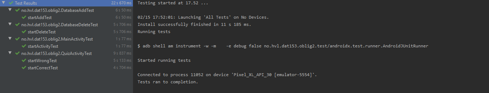

# Dat153_Oblig2
Oblig2 quiz app V2

Oppdaterte oblig1 quiz app med å legge til Room database support og la til noen espresso tester

5 tester.
- Sjekk om knapp på main activity funker
- Sjekk om riktig svar på quiz activity gir poeng
- Sjekk om feil svar på quiz activity ikke gir poeng
- Sjekk om sletting av element i database faktisk fjerner elementet i databasen og ikke bare i bruker grensesnittet
- Sjekk om adding av element i database faktisk legger til elementet i databasen og ikke bare i bruker grensesnittet

# DatabaseAddTest
startAddTest:
Sjekker størelsen til databasen
Legger til ett element i databasen
Sjekker at elementet er lagt til i databasen med å se om størrelsen til databasen har økt med ett element

# DatabaseDeleteTest
startDeleteTest:
Sjekker størelsen til databasen
Sletter ett element i databasen
Sjekker at elementet er slettet fra databasen med å se om størrelsen til databasen har blitt mindre med ett element

# MainActivityTest
startActivityTest:
Klikker knapp til quiz activity.
Sjekker om det som er vist på skjermen er det samme som quizActivity layout

# QuizActivityTest
startWrongTest:
Svarer feil på quiz spørsmål
Sjekker om scoren ikke øker

startCorrectTest:
Svarer riktig på quiz spørsmål
Sjekker om scoren øker

